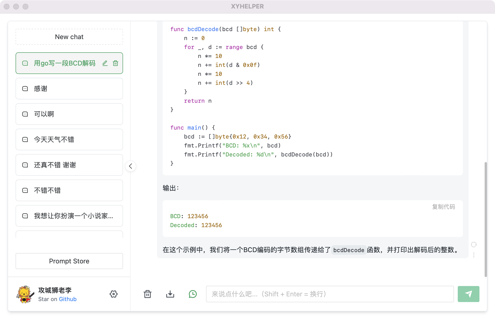

# xyhelper-desktop

xyhelper-desktop 是 xyhelper 的桌面版，基于 Wails 开发，使用 Go 语言编写。

本项目旨在提供一个简单易用 GUI 版的 ChatGPT 机器人，方便用户使用。

使用时无需魔法, 也不需要账号密码, 只需要在本地运行即可。

对接 chat.openai.com 的对话接口,不使用 API Key, 也不需要注册账号。

支持的平台: Windows10/11, Linux, MacOS (注意:因缺乏测试环境,暂未提供编译好的 Linux 版本,需要自行编译)

## 界面展示



## 下载

WIN10/11

- [Github 下载](https://github.com/xyhelper/xyhelper-desktop/releases/latest/download/xyhelper-windows-amd64.zip)
- [ghproxy 加速下载](https://ghproxy.com/github.com/xyhelper/xyhelper-desktop/releases/latest/download/xyhelper-windows-amd64.zip)

MacOS/Intel

- [Github 下载](https://github.com/xyhelper/xyhelper-desktop/releases/latest/download/xyhelper-darwin-amd64.zip)
- [ghproxy 加速下载](https://ghproxy.com/github.com/xyhelper/xyhelper-desktop/releases/latest/download/xyhelper-darwin-amd64.zip)

MacOS/Apple Silicon

- [Github 下载](https://github.com/xyhelper/xyhelper-desktop/releases/latest/download/xyhelper-darwin-arm64.zip)
- [ghproxy 加速下载](https://ghproxy.com/github.com/xyhelper/xyhelper-desktop/releases/latest/download/xyhelper-darwin-arm64.zip)

## 捐赠

如果你觉得这个项目对你有帮助, 请考虑捐赠, 以支持项目的持续开发。


## 关于API网关

因为 chatgpt 的对话接口是不能直接调用的, 需要通过 API 网关才能调用, 所以本项目使用了一个 API 网关。

Cloudflare `加速` 后的网关地址为(一般适合境外用户):

```
https://freechat.xyhelper.com
```
未加速网关地址为:

```
https://freechat.lidong.xin
```
如果你想自己搭建 API 网关, 请联系我们。


## 友情链接

- [CoolAdmin](https://cool-js.com) - 一个项目,用COOL就够了。AI编码、物联网、函数云开发等更加智能和全面的功能，让应用开发紧跟时代的步伐，cool绝不落后！！！ 
